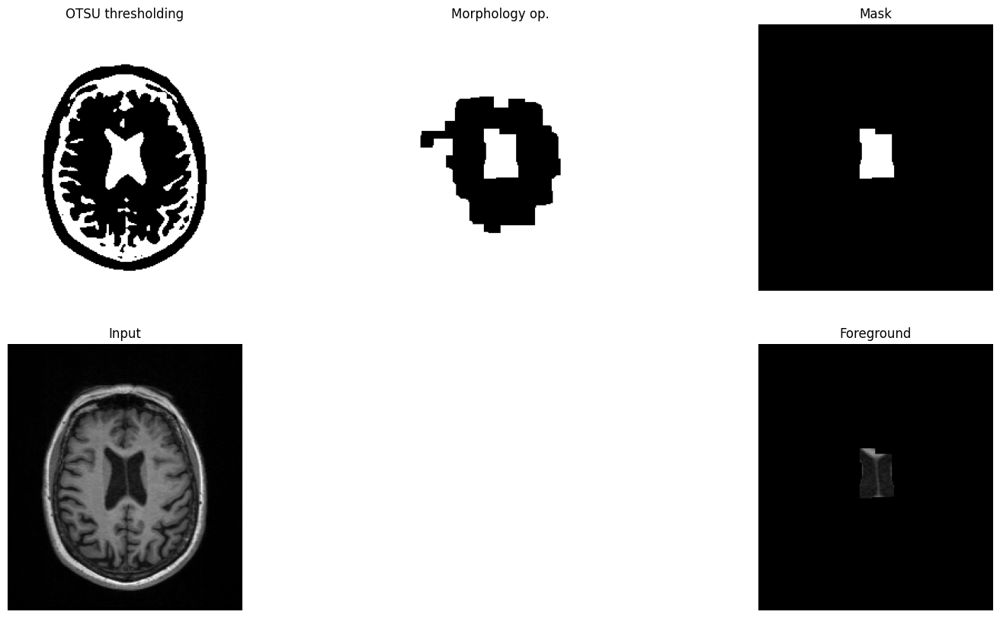
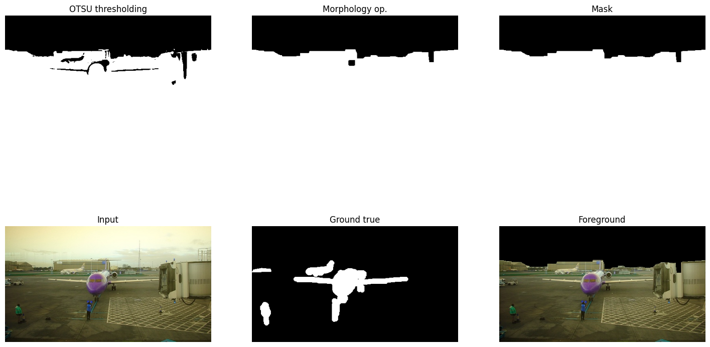
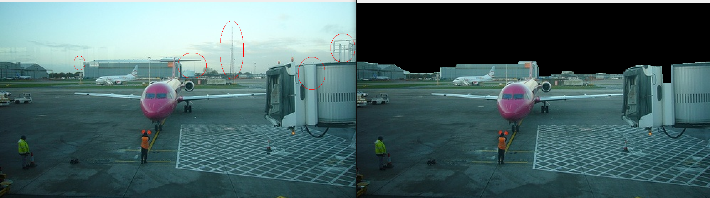
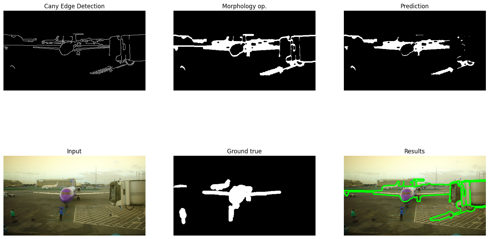
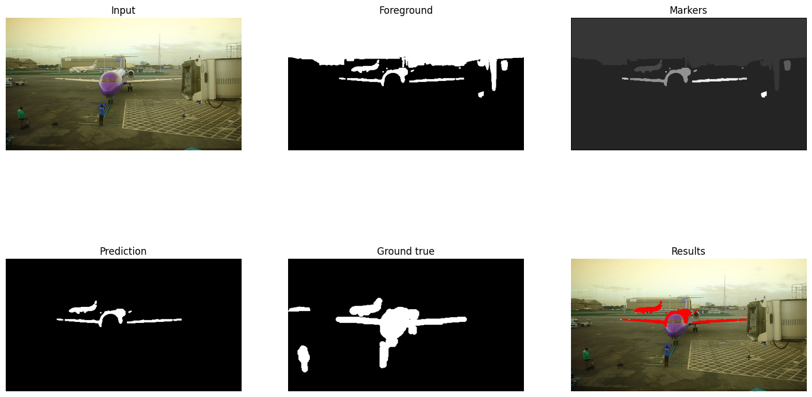
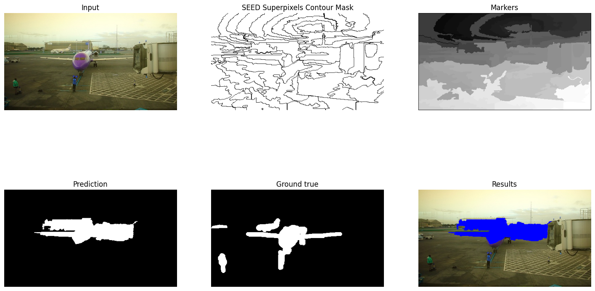

# Optical flow, motion tracking, segmentation, stereo vision
Erik Matovič   
Methods used: sparse optical flow, dense optical flow, background subtraction, grabcut, superpixels, watershade segmentation

## Usage
To run Jupyter Notebook, you need OpenCV and matplotlib. You can install them using pip:  
```bash
pip install opencv-contrib-python matplotlib numpy
```

[OpenCV documentation](https://docs.opencv.org/4.7.0/)

## Assignment
### Exploratory Data Analysis

For this experiment, we used annotated videos of crossing pedestrians in three scenarios: 
- a pedestrian is crossing a four-way until he reaches starting point,
- a pedestrian crossing at the crosswalk,
- a pedestrian walking and running in the night.

In the end, we used classical approaches of motion tracking utilizing sparse and dense optical flow. Thus labels were not needed because, for this experiment, we have not used a deep learning approach.

Dataset: https://www.kaggle.com/datasets/smeschke/pedestrian-dataset?resource=download

### Data Preprocessing
We have utilized OpenCV objects for working with video capture, and for saving outcomes as videos, we have used video writer:
```python3
def get_cap_out(video_path:str, out_root:str='..', start_idx:int=15) -> Tuple[cv2.VideoCapture,
                                                                              cv2.VideoWriter]:
    """
    Read video capture and make video writer.
    :param video_path:  path of the input 
    :param out_root:    path of the output folder
    :param start_idx:   index for the name of the output video 
    returns: cv2.VideoCapture, cv2.VideoWriter 
    """
    # load video
    cap = cv2.VideoCapture(video_path)

    # convert the resolutions from float to integer.
    frame_width = int(cap.get(3))
    frame_height = int(cap.get(4))

    # make video writer
    out = cv2.VideoWriter(out_root + video_path[start_idx:-4] + '.avi', cv2.VideoWriter_fourcc('M','J','P','G'), 10, (frame_width,frame_height))
    return cap, out
```

### Experiment 01: Sparse optical flow
Visualize trajectories of moving objects.

Use following functions: cv::goodFeaturesToTrack, cv::calcOpticalFlowPyrLK

Sparse optical flow with only 1 Shi-Tomasi Corner Detection and computation via Lucas-Kanade Optical Flow between previous and current frame:

```python3
def sparse_optical_flow(cap: cv2.VideoCapture, out: cv2.VideoWriter, 
                        ShiTomasi_params: dict, pyrLK_params: dict, 
                        use_gamma:bool=False, gamma:float=2.0) -> None:
    """
    Sparse optical flow with only 1 Shi-Tomasi Corner Detection and 
    computation via Lucas-Kanade Optical Flow between previous and current frame.
    """
    # Take first frame and find corners in it
    ret, old_frame = cap.read()
    old_gray = cv2.cvtColor(old_frame, cv2.COLOR_BGR2GRAY)

    # Shi-Tomasi Corner Detection
    corners = cv2.goodFeaturesToTrack(old_gray, **ShiTomasi_params)

    # mask image for drawing purposes
    mask = np.zeros_like(old_frame)

    # list of random colors
    color = np.random.randint(0, 255, (100, 3))

    # Lucas-Kanade Optical Flow
    ret, frame = cap.read()
    while(ret):
        frame_gray = cv2.cvtColor(frame, cv2.COLOR_BGR2GRAY)
        # calculate optical flow
        # nextPts = 2D next points
        # st = status vector, 1 if the the corresponding features has been found
        nextPts, st, err = cv2.calcOpticalFlowPyrLK(old_gray, frame_gray, corners, None, **pyrLK_params)
        
        # Select good points based on status
        if nextPts is not None:
            good_new = nextPts[st==1]
            good_old = corners[st==1]

        # draw the tracks
        for i, (new, old) in enumerate(zip(good_new, good_old)):

            # reuse the color vector, if it is too short
            if i >= len(color):
                  i %= 10 

            a, b = new.ravel()
            c, d = old.ravel()
            pt1, pt2 = (int(a), int(b)), (int(c), int(d))
            mask = cv2.line(mask, pt1, pt2, color[i].tolist())
        
        # use for a night scenario
        if use_gamma:
            # preprocessing
            frame = frame.astype(np.float32)
            frame /= 255.0 
            # gamma correction
            frame = pow(frame, 1/gamma)
            # postprocessing
            frame *= 255.0
            frame = frame.astype(np.uint8)

        img = cv2.add(frame, mask)

        # write the flipped frame
        out.write(img)
        
        # update the previous frame and previous points
        old_gray = frame_gray.copy()
        corners = good_new.reshape(-1, 1, 2)

        # read next frame
        ret, frame = cap.read()
        
    # Release everything if job is finished
    cap.release()
    out.release()
    cv2.destroyAllWindows()
```

Sparse optical flow with Shi-Tomasi Corner Detection updating in every five frames. Lucas-Kanade Optical Flow computation done between the previous and current frame and the current and previous frame. We use threshold filtering after Euclidian distance computation between two optical flows to choose appropriate tracking points. We have also manipulated a mask and skipped the upper third of a region of interest because the movement in the sky is not expected:

```python3
def sparse_optical_flow2(cam: cv2.VideoCapture, out: cv2.VideoWriter,
        ShiTomasi_params: dict, pyrLK_params: dict,
        frame_interval: int=5, good_threshold:int=1) -> None:
    """ 
    Sparse optical flow with Shi-Tomasi Corner Detection updating in every five frames. 
    Lucas-Kanade Optical Flow computation done between the previous and current frame 
    and the current and previous frame. We use threshold filtering after Euclidian distance 
    computation between two optical flows to choose appropriate tracking points.
    We have also manipulated a mask and skipped the upper third of a region of interest 
    because the movement in the sky is not expected.
    """
    frame_counter = 0
    tracks = list()

    # first frame
    ret, old_frame = cam.read()
    prev_gray = cv2.cvtColor(old_frame, cv2.COLOR_BGR2GRAY)

    # next frame
    ret, frame = cam.read()
    while ret:
        frame_gray = cv2.cvtColor(frame, cv2.COLOR_BGR2GRAY)
        
        # update the existing tracks by performing optical flow analysis
        if len(tracks) > 0:
            # array of shape (num_tracks, 1, 2) containing the last known positions of each track
            p0 = np.float32([track[-1] for track in tracks]).reshape(-1, 1, 2)
            
            # optical flow between previous and next frame with p0 as the starting point
            p1, _st, _err = cv2.calcOpticalFlowPyrLK(prev_gray, frame_gray, p0, None, **pyrLK_params)
            
            # check the correctness of the calculated optical flow
            # optical flow between next and previous frame with p1 as the starting point
            p0_check, _st, _err = cv2.calcOpticalFlowPyrLK(frame_gray, prev_gray, p1, None, **pyrLK_params)

            # Euclidean distance d between p0 and p0_check for each track, 
            # store it in an array of shape (num_tracks,)
            # check if the calculated optical flow is accurate
            # if the distance is too large, it indicates that the optical flow 
            # calculation is incorrect and the track should be discarded            
            d = abs(p0 - p0_check).reshape(-1, 2).max(-1)

            # boolean array of shape (num_tracks,)
            # good[i] is True if the distance d[i] is less than a threshold value of 1, 
            # indicating that the optical flow calculation is accurate
            # good is used to filter out tracks that have inaccurate optical flow.
            good = d < good_threshold

            new_tracks = []

            # loop through each track and its new position p1, and good flag
            for track, (x, y), good_flag in zip(tracks, p1.reshape(-1, 2), good):
                # skip tracks not corresponding with threshold
                if not good_flag:
                    continue
                # if good is True, append the new position to the track
                track.append((x, y))
                # delete the oldest position if the track length exceeds the number of tracks.
                if len(track) > len(tracks):
                    del track[0]
                new_tracks.append(track)
            tracks = new_tracks
            
            # connects the points in each track
            cv2.polylines(frame, [np.int32(tr) for tr in tracks], False, (0, 255, 0), thickness=1)

        # update ShiTomasi corner detection
        if frame_counter % frame_interval == 0:
            mask = np.zeros_like(frame_gray)

            # mask with skipped ROI 1/3 from up(movement in the sky is not expected)
            frame_height = int(cam.get(4))
            mask[int(frame_height / 3):][:] = 255
            corners = cv2.goodFeaturesToTrack(frame_gray, mask=mask, **ShiTomasi_params)
            
            # update points in tracker
            if corners is not None:
                #tracks = list()
                for x, y in np.float32(corners).reshape(-1, 2):
                    tracks.append([(x, y)])

        frame_counter += 1
        prev_gray = frame_gray

        # next frame
        out.write(frame)
        ret, frame = cam.read()

    # Release everything if job is finished
    cam.release()
    out.release()
    cv2.destroyAllWindows()
```

### Experiment 02: Dense optical flow

Identify moving objects in video and draw green rectangle around them.

Use downsampled video for this task if necessary for easier processing.

Use following functions: cv::calcOpticalFlowFarneback

[OpenCV's tutorial on how to optical flow](https://docs.opencv.org/4.x/d4/dee/tutorial_optical_flow.html)

Motion tracking Datasets

Feel free to experiment with multiple videos for motion tracking. Use the following link for additional datasets - https://motchallenge.net/data/MOT15/


```python3

```

### Experiment 03: Segmentation using background subtraction

Use background substraction methods to properly segment the moving objects from their background. Use one of the videos with static camera.

Use the following approaches:

    Accumulated weighted image

    Mixture of Gaussian (MOG2)


```python3

```


```python3

```


### Experiment 04: Grab Cut segmentation

Propose a simple method to segment a rough estimate of lateral ventricle segmentation using morphological processing and thresholding.

[Link, 5 x PNG, 137 KB](https://drive.google.com/file/d/1hnQ_PHx0LhMNCMlpwCFhXVx4fFl9j_Aq/view) 

Use OpenCV's graph cut method to refine segmentation boundary.

cv::grabCut

Input has to be BGR (3 channel)

Values for the mask parameter:

GC_BGD = 0 - an obvious background pixels

GC_FGD = 1 - an obvious foreground (object) pixel

GC_PR_BGD = 2 - a possible background pixel

GC_PR_FGD = 3  - a possible foreground pixel

An example of GrabCut algorithm: [link](https://docs.opencv.org/4.x/dd/dfc/tutorial_js_grabcut.html) (note: This example uses a defined rectangle for grabcut segmentation. In our case we want to use the mask option instead)

```python3
def grabcut(path:str) -> None:
    """
    GrabCut implementation.
    :param path: image path
    """
    # load the image
    img = cv2.imread(path)

    # convert to grayscale
    gray = cv2.cvtColor(img, cv2.COLOR_BGR2GRAY)

    # Gaussian blurring to denoise image
    blur = cv2.GaussianBlur(gray, (5, 5), 0)

    # threshold the image
    ret, thresh = cv2.threshold(blur, 127, 255, cv2.THRESH_BINARY_INV+cv2.THRESH_OTSU)

    # morphological operations
    kernel = np.ones((3,3), np.uint8)
    closing = cv2.morphologyEx(thresh, cv2.MORPH_CLOSE, kernel, iterations=5)
    opening = cv2.morphologyEx(closing, cv2.MORPH_OPEN, kernel, iterations=5)
    
    # contours analysis
    contours, _ = cv2.findContours(opening, cv2.RETR_LIST, cv2.CHAIN_APPROX_SIMPLE)

    # mask for the region of interest (ROI)
    mask = np.zeros(img.shape[:2], np.uint8)

    # draw contour on mask
    for i in range(0, len(contours)):
        # lateral ventricle is a small part of a brain, so smaller area is favourable
        if cv2.contourArea(contours[i]) < 10000:
            cv2.drawContours(mask, contours, i, (255, 255, 255), cv2.FILLED)
        i += 1

    # Define background and foreground models
    bgdModel = np.zeros((1, 65), np.float64)
    fgdModel = np.zeros((1, 65), np.float64)

    # no rectangle - based on the assignment
    rect = None 
    mask[mask==255] = 1

    # GrabCut on the ROI
    mask, bgdModel, fgdModel = cv2.grabCut(img, mask, rect, bgdModel, fgdModel, iterCount=5, mode=cv2.GC_PR_FGD)

    # extract the foreground from the mask
    foreground_mask = np.where((mask == cv2.GC_FGD) | (mask == cv2.GC_PR_FGD), 255, 0).astype('uint8')
    foreground = cv2.bitwise_and(img, img, mask=foreground_mask)
```
Our proposed method for a rough estimation of lateral ventricle:
1. read the image
2. convert the image to grayscale
3. denoising by Gaussian blurring
4. thresholding gets us the binary image
5. morphological operations
6. create a mask by contour analysis - draw the contour with the smallest area
7. GrabCut algorithm on the region of interest
8. extract the foreground from the mask

The overall process:
<p align="center">
	
</p>

### Experiment 05: VOC12 dataset segmentation

JPEG images: [link](https://drive.google.com/file/d/1MTgdBUwwBljzHIGz3bIqdLfu4qPx-PuP/view?pli=1) 

Ground truth labels: [link](https://drive.google.com/file/d/1lR-Ihrg7yE0YVS9PxZTW-_XT6C8rZEnc/view)

Propose a simple method for object segmentation. Pick 1-2 images from the provided dataset. You may use one or multiple segmentation methods such as:

    grabcut

    superpixel segmentation

    floodfill

    thresholding

    and so on..

Use provided ground truth label to compute Dice Score with your prediction (you may chose only 1 specific object for segmentation in case of multiple objects presented in the image)

Dice Score computation:
```python3
def dice_score(true, prediction, max_value:int=255):
    """
    2 * |A ∩ B| / (|A| + |B|)
    """
    return 2.0 * np.sum(prediction[true==max_value]) / (true.sum() + prediction.sum())
```

Firstly, we must binarize ground truth images for a Dice Score computation:
```python3
def binarize_ground_truth(true_path:str):
    """
    returns: binary image of a ground truth 
    """
    true = cv2.imread(true_path)
    true = cv2.cvtColor(true, cv2.COLOR_BGR2GRAY)
    threshold_value = 0
    max_value = 255
    return cv2.threshold(true, threshold_value, max_value, cv2.THRESH_BINARY)[1]
```

#### Grabcut
Our proposed method using GrabCut algorithm for object segmentation:
1. read the image and the ground truth
2. convert the image to grayscale
3. denoising by Gaussian blurring
4. thresholding gets us the binary image
5. morphological operations
6. create a mask by contour analysis - draw the contours for the areas greater than 1000
7. GrabCut algorithm on the region of interest
8. extract the foreground from the mask
9. binarize the ground truth
10. compute the dice score of the ground truth and the mask

```python3
def grabcut(img_path:str, true_path:str):
    # load the image
    img = cv2.imread(img_path)

    # load binarized ground truth
    true = binarize_ground_truth(true_path)

    # convert to grayscale
    gray = cv2.cvtColor(img, cv2.COLOR_BGR2GRAY)

    # Gaussian blur to denoise image
    blur = cv2.GaussianBlur(gray, (5, 5), 0)

    # threshold the image
    ret, thresh = cv2.threshold(blur, 127, 255, cv2.THRESH_BINARY_INV+cv2.THRESH_OTSU)

    # morphological operations
    kernel = np.ones((3,3), np.uint8)
    closing = cv2.morphologyEx(thresh, cv2.MORPH_CLOSE, kernel, iterations=5)
    opening = cv2.morphologyEx(closing, cv2.MORPH_OPEN, kernel, iterations=5)

    # contours analysis
    contours, _ = cv2.findContours(opening, cv2.RETR_LIST, cv2.CHAIN_APPROX_SIMPLE)

    # create a mask for the region of interest (ROI)
    mask = np.zeros(img.shape[:2], np.uint8) # np.zeros_like(opening)

    # Draw contour on mask
    for i in range(0, len(contours)):
        # update from previous grabcut - ignore small areas
        if cv2.contourArea(contours[i]) > 1000:
            cv2.drawContours(mask, contours, i, (255, 255, 255), cv2.FILLED)
        i += 1

    # Define background and foreground models
    bgdModel = np.zeros((1, 65), np.float64)
    fgdModel = np.zeros((1, 65), np.float64)
    
    # Perform GrabCut on the ROI
    rect = None 
    mask[mask==255] = 1
    
    mask, bgdModel, fgdModel = cv2.grabCut(img, mask, rect, bgdModel, fgdModel, iterCount=5, mode=cv2.GC_PR_FGD)

    # extract the foreground from the mask
    foreground_mask = np.where((mask == cv2.GC_FGD) | (mask == cv2.GC_PR_FGD), 255, 0).astype('uint8')
    foreground = cv2.bitwise_and(img, img, mask=foreground_mask)

    # for a Dice Score
    mask[mask == 1] = 255

    print(f'Dice score is {dice_score(true, mask)}')
```

The overall process:
<p align="center">
	
</p>

The Dice Score is not satisfying with its roughly 0.21 value. However, we have successfully removed the sky. Red ellipses show removed objects:
<p align="center">
	
</p>


#### Canny Edge Detection and Contour Analysis
Our proposed method using Canny & contours for object segmentation:
1. read the image and the ground truth
2. convert the image to grayscale
3. denoising
4. Canny Edge Detection
5. morphological operations
6. create a mask by contour analysis - draw the contours for the areas greater than 10000
7. binarize the ground truth
8. compute the dice score of the ground truth and the mask


```python3
def contours(img: cv2.Mat, img_input: cv2.Mat, mode: Any, method: int, are:int=10000) -> Tuple[cv2.Mat, cv2.Mat]:
    """
    Countour analysis
    :param: img - original image
    :param: img_input - image after morphological operation
    :param: mode - mode in cv2.findContours
    :param: method - method in cv2.findContours
    :returns: tuple of resulting image and mask
    """
    img_result = img.copy()
    prediction_ = img_input.copy()
    img_contours, _ = cv2.findContours(img_input, mode, method)

    for i in range(0, len(img_contours)):
        if cv2.contourArea(img_contours[i]) > area:
            cv2.drawContours(img_result, img_contours, i, (0, 255, 0), 4)
            cv2.drawContours(prediction_, img_contours, i, (0, 255, 0), 4)
        i += 1
        
    return img_result, prediction_
```

```python3
def canny_contour_segmentation(img_path:str, gt_path:str, area:int=10000):
    # read img
    img = cv2.imread(img_path)

    # grayscale
    img_gray = cv2.cvtColor(img, cv2.COLOR_BGR2GRAY)

    # blurring
    img_gauss = cv2.GaussianBlur(img_gray, (5,5), 0)

    # canny edge detection
    img_canny = cv2.Canny(img_gauss, 50, 300)

    # morphology operation
    element = cv2.getStructuringElement(cv2.MORPH_ELLIPSE, (5,5))
    img_dilate = cv2.dilate(img_canny,(7, 7), iterations=5)
    img_erode = cv2.erode(img_dilate, kernel=(11,11))
    img_closing = cv2.morphologyEx(img_erode, cv2.MORPH_CLOSE, element, iterations=1)
    
    img_result, prediction = contours(img, img_closing, cv2.RETR_EXTERNAL, cv2.CHAIN_APPROX_SIMPLE, area)

    true = binarize_ground_truth(gt_path)
    
    dice_s = dice_score(prediction, true, 255) 
    print ("Dice Similarity: {}".format(dice_s))
```

The Dice Score is not satisfying with its roughly 0.42 value. However, it is a better than with the Grab Cut algorithm. The overall process:
<p align="center">
	
</p>

#### Watershed
Our proposed method uses the watershed algorithm for object segmentation:
1. read the image and the ground truth
2. convert the image to grayscale
3. denoising
4. OTSU thresholding
5. morphological operations to make the foreground
6. apply watershed
7. make prediction mask from given labels
8. binarize the ground truth
9. compute the dice score of the ground truth and the mask

```python3
def watershade(img_path:str, gt_path:str):
    """
    Inspired by OpenCV tutorial:
    https://docs.opencv.org/4.x/d3/db4/tutorial_py_watershed.html
    """
    # read img
    img = cv2.imread(img_path)
    img_result = img.copy()

    # grayscale
    img_gray = cv2.cvtColor(img, cv2.COLOR_BGR2GRAY)

    # blurring
    img_gauss = cv2.GaussianBlur(img_gray, (5,5), 0)

    # thresholding
    ret, thresh = cv2.threshold(img_gauss, 127, 255, cv2.THRESH_BINARY+cv2.THRESH_OTSU)
        
    # morphology operations - make foreground
    kernel = np.ones((3,3),np.uint8)
    closing = cv2.morphologyEx(thresh,cv2.MORPH_CLOSE, kernel, iterations=1)

    # sure foreground area
    sure_fg = cv2.dilate(closing,kernel,iterations=1)

    # Marker labelling
    ret, markers = cv2.connectedComponents(sure_fg)

    # Add one to all labels so that sure background is not 0, but 1
    markers = markers+1

    markers = cv2.watershed(img, markers)
    # small plane
    img_result[markers == 3] = [255,0,0]
    # parts of a larger plane
    img_result[markers == 7] = [255,0,0]
    img_result[markers == 8] = [255,0,0]
    img_result[markers == 9] = [255,0,0]
    img_result[markers == 10] = [255,0,0]
    img_result[markers == 11] = [255,0,0]
    img_result[markers == 12] = [255,0,0]

    prediction = np.zeros(img_result.shape[:-1], dtype=np.uint8)
    # small plane
    prediction[markers == 3] = [255]
    # parts of a larger plane
    prediction[markers == 7] = [255]
    prediction[markers == 8] = [255]
    prediction[markers == 9] = [255]
    prediction[markers == 10] = [255]
    prediction[markers == 11] = [255]
    prediction[markers == 12] = [255]

    true = binarize_ground_truth(gt_path)

    dice_s = dice_score(prediction, true, 255) 
    print ("Dice Score: {}".format(dice_s))
```
The Dice Score is not satisfying with its roughly 0.37 value. However, we have successfully segmented a more distant aeroplane and parts of the closer plane. The overall process:
<p align="center">
	
</p>


#### SEED Superpixels followed by Watershed
Our proposed method uses the SEED superpixels and then apply the watershed algorithm for object segmentation:
1. read the image and the ground truth
2. convert the image to grayscale
3. denoising
4. apply SEED superpixels
5. apply watershed
6. make prediction mask from given labels
7. binarize the ground truth
8. compute the dice score of the ground truth and the mask

```python3
def superpixels_watershed(img_path:str, gt_path:str):
    """
    superpixels followed by watershed
    """
    # read img
    img = cv2.imread(img_path)
    img_result = img.copy()

    # grayscale
    img_gray = cv2.cvtColor(img, cv2.COLOR_BGR2GRAY)

    # blurring
    img_gauss = cv2.GaussianBlur(img_gray, (5,5), 0)

    # Adjust the parameters as needed
    img_width = img_gauss.shape[1]
    img_height = img_gauss.shape[0]
    img_channels = 1  # for grayscale image
    num_superpixels = 100
    num_levels = 4
    prior = 2
    histogram_bins = 100000
    double_step = True

    # Create SuperpixelSEEDS object
    seeds = cv2.ximgproc.createSuperpixelSEEDS(img_width, 
                                            img_height, 
                                            img_channels, 
                                            num_superpixels, 
                                            num_levels, 
                                            prior, 
                                            histogram_bins, 
                                            double_step)

    # Initialize superpixels
    seeds.iterate(img_gauss, 100)

    # superpixels contour mask
    contour_mask = seeds.getLabelContourMask()
    contour_mask[contour_mask == 255] = 1

    contour_mask = cv2.bitwise_not(contour_mask)

    # Get the labels
    labels = seeds.getLabels()

    # Set mask
    mask = np.zeros_like(contour_mask, dtype=np.int32)
    for i in range(num_superpixels):
        mask[labels == i] = i

    # Apply watershed algorithm
    markers = cv2.watershed(img, mask)

    # make prediction masks
    prediction = np.zeros(img_result.shape[:-1], dtype=np.uint8)
    prediction[markers == 12] = [255]
    prediction[markers == 23] = [255]
    prediction[markers == 24] = [255]
    prediction[markers == 25] = [255]
    prediction[markers == 26] = [255]

    # results
    img_result[markers == 12] = [0, 0, 255]
    img_result[markers == 23] = [0, 0, 255]
    img_result[markers == 24] = [0, 0, 255]
    img_result[markers == 25] = [0, 0, 255]
    img_result[markers == 26] = [0, 0, 255]

    true = binarize_ground_truth(gt_path)

    dice_s = dice_score(prediction, true, 255) 
    print ("Dice Score: {}".format(dice_s))
```

The Dice Score is the best we have achieved, with its roughly 0.55 value. This is because our segmentation covers more of the ground truth labels. The overall process:
<p align="center">
	
</p>